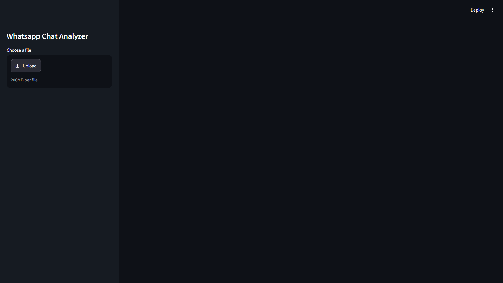
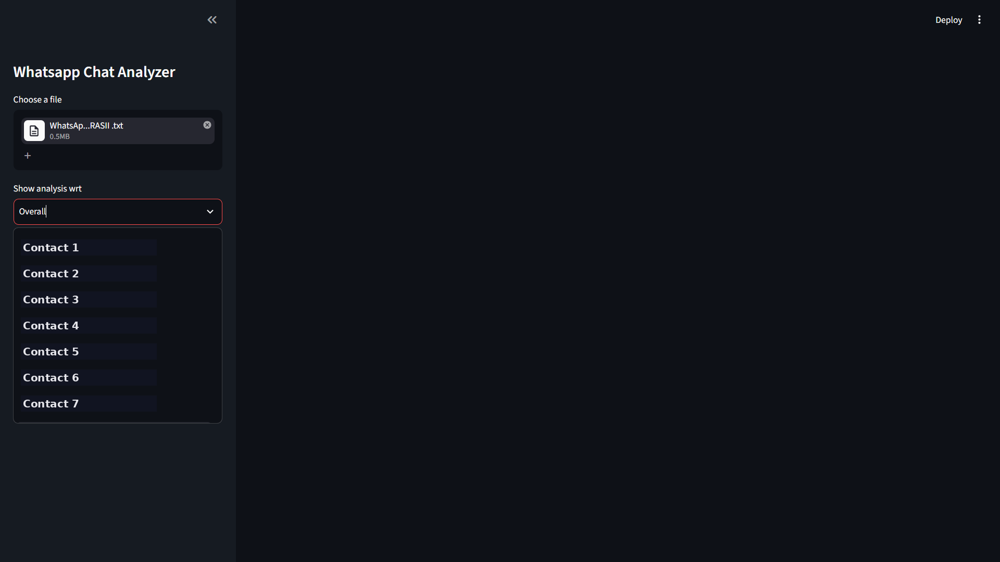
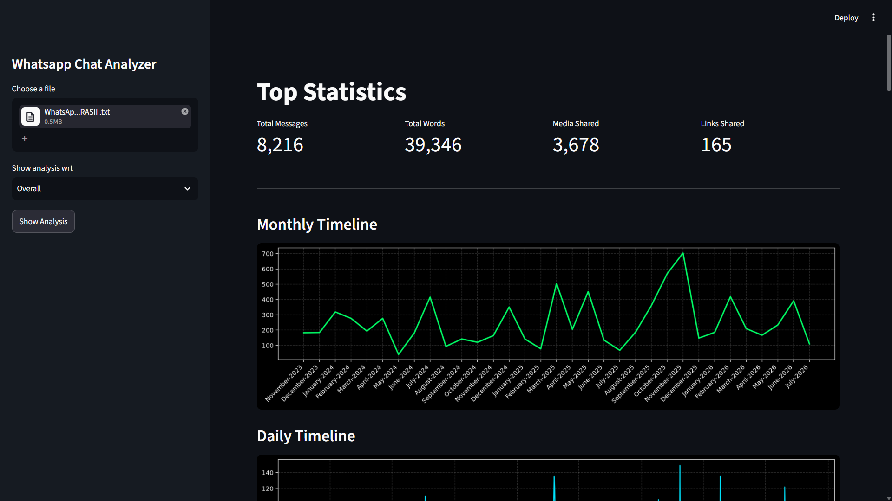
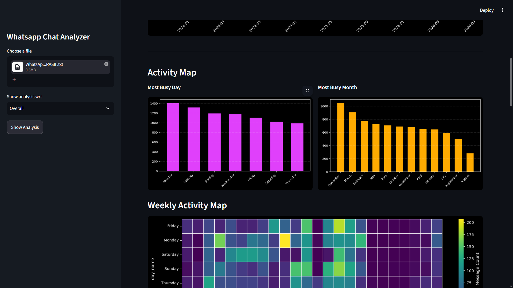
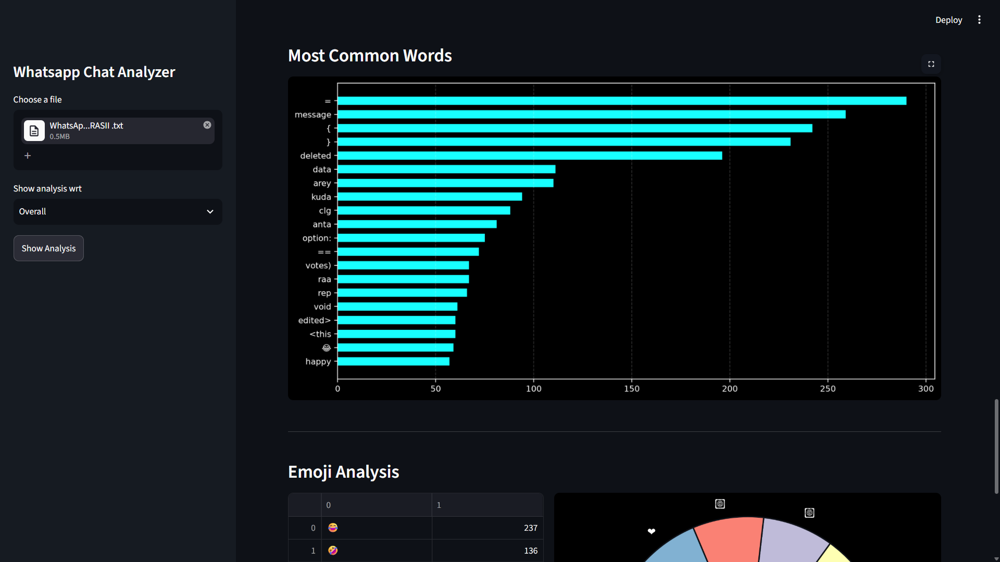

# 💬 WhatsApp Chat Analyzer

[](https://streamlit.io)
[](https://www.python.org/downloads/)
[](https://opensource.org/licenses/MIT)

> A Streamlit dashboard that turns your exported WhatsApp chat `.txt` file into interactive charts and stats — who's most active, peak chat hours, emoji trends, and more.

---

## 🚀 Features

- **Works with Android & iOS exports** — auto-detects timestamp formats and handles tricky encodings.
- **Dark-themed UI** with clean metric cards and colorful charts.
- **Key stats at a glance**: total messages, words, media shared, links shared.
- **Timelines**: monthly and daily message trends.
- **Activity insights**: busiest day/month, plus a 24×7 heatmap of when people chat most.
- **Per-user or group view**: analyze the whole group or drill into one person.
- **Word & emoji analysis**: word cloud, top 20 words (with Hinglish stopword filtering), and emoji usage breakdown.

---

## 📸 Screenshots

**Upload your chat file**


**Pick a user to analyze**


**Top-level stats & timeline**


**Activity map (busiest days/months)**


**Word frequency & emoji breakdown**


---

## 🛠️ Tech Stack

- **Frontend:** Streamlit
- **Data:** Pandas, NumPy, Regex
- **Charts:** Matplotlib, Seaborn
- **NLP/Text:** wordcloud, urlextract, emoji

## 📂 Project Structure

```
chat_analyzer/
├── app.py              # Streamlit app & UI
├── preprocessor.py     # Cleans and parses the raw chat file
├── helper.py            # Stats, NLP, and chart logic
├── requirements.txt     # Dependencies
├── stop_hinglish.txt    # Custom stopword list
└── README.md
```

---

## ⚙️ Setup

```bash
# 1. Clone the repo
git clone https://github.com/yourusername/chat_analyzer.git
cd chat_analyzer

# 2. (Recommended) create a virtual environment
python -m venv venv
source venv/bin/activate   # Windows: venv\Scripts\activate

# 3. Install dependencies
pip install -r requirements.txt

# 4. Run the app
streamlit run app.py
```

The app opens automatically at `http://localhost:8501`.

> **Note:** Make sure `stop_hinglish.txt` exists in the project root with common filler words (one per line). Create an empty one if you don't have it.

---

## 📱 Exporting Your Chat

**Android:** Open the chat → tap **⋮** → **More** → **Export chat** → **Without media**

**iOS:** Open the chat → tap the contact/group name → scroll down → **Export Chat** → **Without Media**

---

## 💡 How to Use

1. Upload your exported `.txt` file in the sidebar.
2. Pick **Overall** for group-wide stats, or select a specific person.
3. Click **Show Analysis** to view the dashboard.

---

## 🎨 Customizing

- Add words to `stop_hinglish.txt` to fine-tune the word cloud.
- Edit the CSS block in `app.py` to change the color theme.
- Extend `preprocessor.py` with `tz_localize()` if your chats span time zones.

---

## 🤝 Contributing

Pull requests are welcome!

1. Fork the repo
2. Create a branch: `git checkout -b feature/YourFeature`
3. Commit: `git commit -m 'Add YourFeature'`
4. Push: `git push origin feature/YourFeature`
5. Open a Pull Request